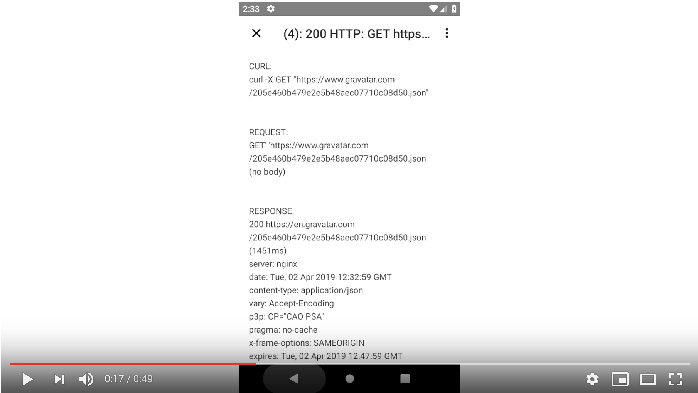

# Logger accessible through a notification

[](https://jitpack.io/#jacek-marchwicki/logs-manager)

LogsManager is a simple and powerful logger that allows displaying all logs from your application by simply tapping the notification.

[](https://youtu.be/9mxNWzh1jw4)

# Reasons for using LogsManager
1. All HTTP requests will automatically be logged with CURLs and response bodies for later debugging.
2. All HTTP 4xx/5xx errors will be easily accessible by testers.
3. In case of failure, you’ll be able to send all logs at once for troubleshooting.
4. After finding an issue, a tester will send you all logs including all requests and responses.
5. LogsManager won’t slow down the production version of your app, because there is a no-op version available.
6. If you as a mobile developer rely on a buggy server, you will be able to log “This is not my fault, this is a buggy response from the server, look at issue #1234” note for your tester.
7. You and your tester will be able to check if analytics events are correct.
8. All exceptions that are interesting to see but shouldn’t be displayed to a user can be logged.

# Configuration

Configure dependencies:

```groovy
repositories {
    maven { url "https://jitpack.io" }
}
```

```groovy
dependencies {
    debugImplementation "com.github.jacek-marchwicki.logs-manager:logsmanager:<look-on-release-tab>"
    releaseImplementation "com.github.jacek-marchwicki.logs-manager:logsmanager-no-op:<look-on-release-tab>"

    debugImplementation "com.github.jacek-marchwicki.logs-manager:logsmanager-okhttp:<look-on-release-tab>"
    releaseImplementation "com.github.jacek-marchwicki.logs-manager:logsmanager-okhttp-no-op:<look-on-release-tab>"
}
```

In case of using Proguard: no need to do anything

Set LogsManager up in your application:

```kotlin
class MainApplication : Application() {

    override fun onCreate() {
        super.onCreate()
        val logsManagerAndroid = LogsManagerAndroid(LogsManagerAndroidSettings(this, Log.VERBOSE))
        LogsManagerAndroid.default = logsManagerAndroid
        LogsSingleton.setup(logsManagerAndroid)
    }
}
```

Log an event:

```kotlin
LogsSingleton.log(Log.VERBOSE, { "Activities" }, { "Start main activity" })
```

Configuration for OkHttp:

```kotlin
val client = OkHttpClient.Builder()
    .addInterceptor(LogsOkHttpInterceptor(LogsSingleton, Log.DEBUG))
    // Your other interceptors
    .build()
```

# FAQ

## How can I log?
```kotlin
LogSingleton.log(Log.WARN, "A title")
```

```kotlin
LogSinglegon.logTitle(Log.WARN) {"A title with a computed value ${2 + 3}"}
```

```kotlin
LogSinglegon.log(Log.WARN, {"Title"}) {"Very long description with a computed value ${2 + 3}"}
```

```kotlin
LogSinglegon.logPair(Log.WARN) {"Title" to "Very long description with a computed value ${2 + 3}"}
```

```kotlin
LogSinglegon.logEntry(Log.WARN) {LogsManager.EntryData("Title", "Very long description with a computed value ${2 + 3}")}
```


## What is the difference between log and logTitle?

Examples:

```kotlin
fun timeConsumingCalculation() = 2 + 3

LogSingleton.log(Log.DEBUG, "A title ${timeConsumingCalculation()}")

LogSingleton.logTitle(Log.DEBUG) { "A title ${timeConsumingCalculation()}" }
```

`logTitle` is more optimal if your logging is disabled, in which case `timeConsumingCalculation()` won’t be executed.


## Can I view logs in Logcat?

Yes

```kotlin
LogsSingleton.setup(LogsManagerLogCat(Log.DEBUG))
```

## Can I view read logs in tests?

Yes

```kotlin
val log = LogsManagerStringTest(Log.DEBUG)
LogsSingleton.setup(log)

log.getEntries()
```

## Can I use more than one log manager?

Yes

```kotlin
LogsSingleton.setup(LogsManagerMultiple(listOf(
  LogsManagerStringTest(Log.DEBUG), 
  LogsManagerLogCat(Log.WARN)
)))
```


## Can I use it in Java?

Yes


## How can I log an exception?

```kotlin
val fileContent = LogsSingleton.logFailure(Log.WARN) {
    readFile()
}
```

or

```kotlin
val fileContent = try {
    readFile()
} catch (e: Exception) {
  LogSingleton.log(Log.WARN, "Can't read file", e)
}
```

# Development

Before doing pull-to-requests please ensure that following execution:

```bash
./gradlew ktlintFormat build connectedCheck
```

runs with `BUILD SUCCESSFUL`.

# License

```
Copyright (C) 2019 Jacek Marchwicki <jacek.marchwicki@gmail.com>

Licensed under the Apache License, Version 2.0 (the "License");
you may not use this file except in compliance with the License.
You may obtain a copy of the License at

     http://www.apache.org/licenses/LICENSE-2.0

Unless required by applicable law or agreed to in writing, software
distributed under the License is distributed on an "AS IS" BASIS,
WITHOUT WARRANTIES OR CONDITIONS OF ANY KIND, either express or implied.
See the License for the specific language governing permissions and
limitations under the License.
```

